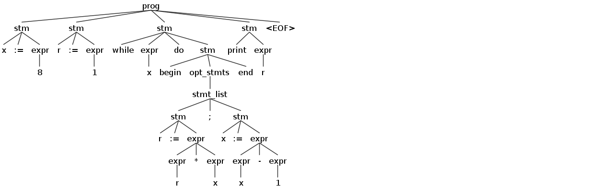
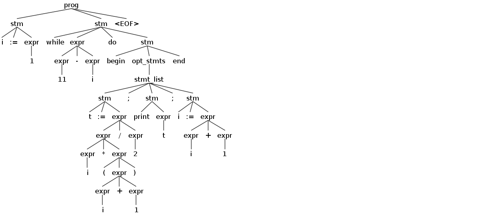
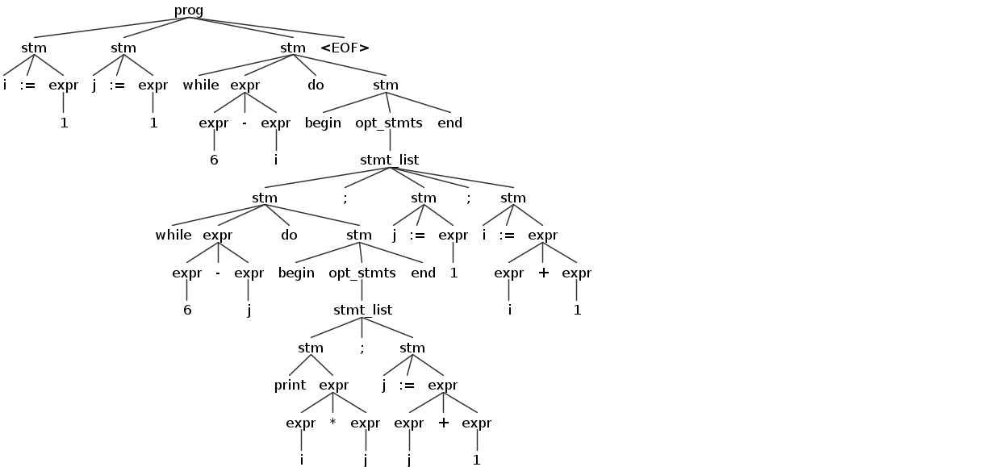
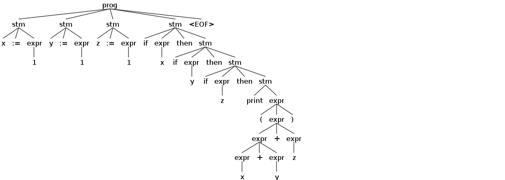

Simple Language to A86 Translator
===================

Introduction:
-------

This project uses the [ANTLR4 parser generator](https://github.com/antlr/antlr4) to translate the Simple language to A86 assembler language.

Given a grammar file conforming to a syntax derived from EBNF, ANTLR4 generates lexer, parser and utility classes for navigating the parse tree. The application code that actually generates the .asm file are SimpleToA86Translator and SimpleToA86Visitor classes.


----------


The Grammar File:
--------
The grammar file in the project is named **Simple.g4** and it is almost a direct translation from the project document

```
grammar Simple;

prog:   stm+ EOF;

stm :   ID ':=' expr            #assign
    |   'print' expr            #print
    |   'if' expr 'then' stm    #ifthen
    |   'while' expr 'do' stm   #whiledo
    |   'begin' opt_stmts 'end' #beginend
    ;

opt_stmts : stmt_list?;

stmt_list : stm (';' stm)*;

expr:   expr op=MUL expr        #mul
    |   expr op=DIV expr        #div
    |   expr op=MOD expr        #mod
    |   expr op=ADD expr        #add
    |   expr op=SUB expr        #sub
    |   INT                     #int
    |   ID                      #id
    |   '(' expr ')'            #parens
    ;

MUL :   '*' ;
DIV :   '/' ;
MOD :   'mod';
ADD :   '+' ;
SUB :   '-' ;
ID  :   [a-zA-Z]+ ;      // match identifiers
INT :   [0-9]+ ;         // match integers
WS: [ \r\n\t] + -> skip;
```
The parser rules are in lowercase and at the top, lexer rules are capitalized and at the bottom.

Note that for each choice specified using "|" in a rule, there is a label at the end. For example
\#assign, \#print, \#ifthen, \#whiledo. The antlr4 tool creates methods corresponding to those in the generated classes which the application programmer like myself can call while traversing the parse tree. The order of the rules are also important for the antlr4 to resolve the precedence order. 

The rule at the end of the file: 
```
WS: [ \r\n\t] + -> skip;
``` 
is a directive telling the lexer to skip whitespace.

----------

Generating the lexer, parser and the visitor classes:
--------
The file **build.sh** in the project root generates those classes and then compiles all the java code in the project, including SimpleToA86Visitor.java and SimpleToA86Translator.java. It executes two commands:

1) The command below generates the java code from the supplied **Simple.g4** file to the **gen** directory.
```
java -cp ".:lib/antlr-4.7-complete.jar:$CLASSPATH" org.antlr.v4.Tool Simple.g4 -visitor -o gen
```
2) Then the project is compiled with:
```
javac -cp ".:lib/antlr-4.7-complete.jar:$CLASSPATH" -sourcepath ".:gen" -d "build" *.java
```

Run ```./build.sh``` to build the project

-------------

Running the translator:
---------
Execute run.sh on a .sim file 

Example:

```
./run.sh test/gcd.sim
```

This produces the out.asm file

-------------

The Visitor and the class with the main method (SimpleToA86Visitor and SimpleToA86Translator):
-----------

The class with the main method is **SimpleToA86Translator**. Here we setup the stage for parsing by instantiating the lexer, parser and visitor objects. The tree traversal is started from the **prog** rule. We assemble the .asm file in pieces. 

The pieces are: 

1) The header for a DOS assembly code ie. ```org 100h```

2) The asm code string returned from the visitor

3) The asm code for program termination in DOS

4) The asm code for the "myprint" procedure

5) The asm code for the variable declarations.


These are concatenated to form the final output file out.asm.
 
After ANTLR4 code generation, we end up with a **SimpleBaseVisitor**, a base class to be extended by the application and implement the translation logic.
So I created the class **SimpleToA86Visitor** that extends from this base class where the visitXXX methods are overriden. Note that **SimpleBaseVisitor** uses Java generics, so I actually extend **SimpleBaseVisitor&lt;String&gt;**. By doing this all the visitXXX methods now return **String** (Here XXX corresponds to a rule label specified in the grammar file as discussed above). The **String** objects those methods return correspond to the assembler fragments necessary to execute that rule. Note that when using the visitor mechanism one is responsible for traversing the tree by calling visitXXX for the children of the current node inside the visitXXX methods. 

In the **SimpleBaseVisitor** class I keep track of when a variable is first seen in **variableDefs** object, so that I create them only once.
Since there can be multiple or nested **if then** or **while do** statements and since they require labels in assembly code for jumping, I also keep track of a **loopIndex** 

-------------

Testing:
-----
I created some .sim programs for testing. The png files are created with antlr

1) factorial.sim : Calculates the factorial of 8 and prints it.

```
x:=8
r:=1

while x do
begin
        r:=r*x;
        x:=x-1
end
print r
```




2) triangularNums.sim : Calculate and print the first 10 triangular numbers.

```
i:=1
while 11-i do
begin
        t:=i*(i+1)/2;
        print t;
        i:=i+1
end
```




3) gcd.sim : Calculates the gcd of 29034 and 4482 and prints it.


```
a:=29034
b:=4482
t:=0
while b do
      begin
        t:=b;
        b:=a mod b;
        a:=t
      end
print a
```


4) exprFromLectureNotes.sim : The expression from the lecture notes with t=13, m=7, d=19


```
t:=13
m:=7
d:=19
val:=(461*t)/4+(200*m+2)/5+d
print val
```


5) innerLoop.sim : prints i*j where 1<=i<=5, 1<=j<=5

```
i:=1
j:=1
while 6-i do
      begin
            while 6-j do
                  begin
                      print i*j;
                      j:=j+1
                  end;
            j:=1;
            i:=i+1
      end
```




6) nestedIf.sim : testing nested if statements

```
x:=1
y:=1
z:=1
if x then if y then if z then print (x+y+z)
```


